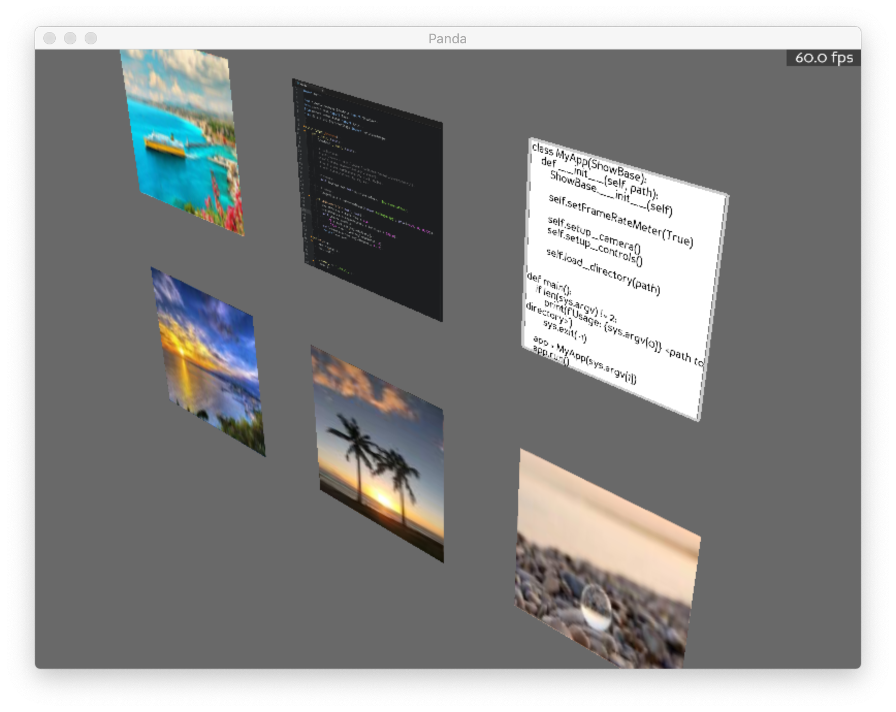

# vrfs

A new way of discovering your filesystem.

Note: this is not an actual fs (so far)




## Usage

```bash
$ python main.py <path to directory>
```

### Controls

Move your mouse to look around.
To move in the world use: `[w]/[a]/[s]/[d]/[space]/[shift]`.
